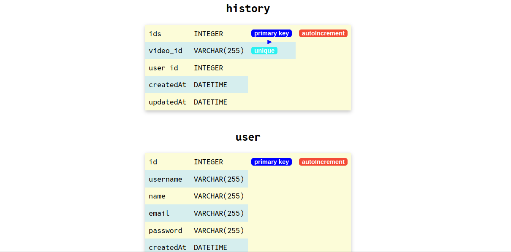

# dbdrawer-sqlz

a cli tool for visualising your sequelize schema. dbdrawer-sqlz checks the data model schemas of your project ("./models") folder and visualises by running on localhost in node environment. it attaches to your project as an npm package.


## Installation

Install dbdrawer-sqlz with npm

```javascript
//install using npm
npm install -g dbdrawer-sqlz
//open terminal and type
dbdraw-s
// hit enter and it will run localhost where you can see your schema, relationship and constraints in a tablular format
```
    
## Screenshots



## Local Setup

```javascript
//To setup the project locally, for the repository and copy the forked copy the https url
//in the terminal write
git clone [repo-url]
cd dbdrawer-sqlz
npm install
// have a project that has "models" folder
//install dbdrawer-mongo to the project globally
npm install -g 
//have a dummy project with models
//create a branch, makes changes and raise PR

//open terminal and type
dbdraw-s
// hit enter and it will run localhost where you can see your schema, relationship and constraints in a tablular format
```


## Contributing

Contributions are always welcome!

See `contributing.md` for ways to get started.

Please adhere to this project's `code of conduct`.


## License

[MIT License](LICENSE)

